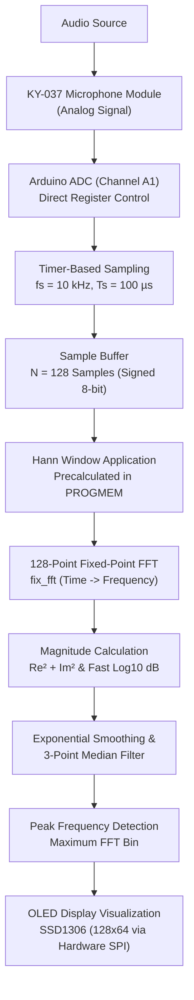

# Real-Time Audio Spectrum Analyzer

[](https://www.arduino.cc/)
[-informational.svg)]()
[]()
[]()
[]()

A real-time embedded audio spectrum analyzer built on the **Arduino Nano (ATmega328P)**. The system samples ambient or incoming audio using a high-sensitivity microphone module, processes the audio signal in real time using a **128-point Fast Fourier Transform (FFT)** with **Hann windowing**, and visualizes the resulting frequency spectrum and dominant peaks on an **SSD1306 128×64 OLED display**.

Developed at the **Centre for Electronic Design and Technology (CEDT)**, **Netaji Subhas University of Technology (NSUT), New Delhi**.

---

## Table of Contents

- [Overview](#overview)
- [System Architecture](#system-architecture)
- [Key Specifications](#key-specifications)
- [Hardware Apparatus & Wiring](#hardware-apparatus--wiring)
- [Digital Signal Processing (DSP) Pipeline](#digital-signal-processing-dsp-pipeline)
  - [1. ADC Configuration & Sampling](#1-adc-configuration--sampling)
  - [2. Hann Windowing](#2-hann-windowing)
  - [3. 128-Point Fixed-Point FFT](#3-128-point-fixed-point-fft)
  - [4. Magnitude & dB Conversion](#4-magnitude--db-conversion)
  - [5. Filtering & Peak Detection](#5-filtering--peak-detection)
- [OLED Visualization](#oled-visualization)
- [Repository Structure](#repository-structure)
- [Getting Started](#getting-started)
  - [Prerequisites & Libraries](#prerequisites--libraries)
  - [Compilation & Upload](#compilation--upload)
- [Authors](#authors)
- [License](#license)

---

## Overview

Sound is inherently time-varying; while time-domain waveforms display amplitude over time, they do not directly reveal the underlying frequency distribution. A spectrum analyzer decomposes this time-domain signal into its constituent frequencies.

This project implements an efficient, embedded DSP pipeline entirely on an 8-bit AVR microcontroller running at 16 MHz. By employing low-level register access, precomputed lookup tables in flash memory (`PROGMEM`), fixed-point arithmetic (`fix_fft`), and hardware SPI display driving, the system achieves smooth real-time frequency analysis from **0 Hz to 5 kHz**.

---

## System Architecture



---

## Key Specifications

| Parameter | Specification |
| :--- | :--- |
| **Microcontroller** | ATmega328P (Arduino Nano @ 16 MHz) |
| **Sampling Frequency ($f_s$)** | $10\text{ kHz}$ |
| **Sampling Period ($T_s$)** | $100\ \mu\text{s}$ |
| **FFT Size ($N$)** | 128 points |
| **Frequency Resolution ($\Delta f$)** | $\frac{f_s}{N} = \frac{10000}{128} = \mathbf{78.125\text{ Hz}}$ |
| **Nyquist Limit ($f_{\text{max}}$)** | $\frac{f_s}{2} = \mathbf{5000\text{ Hz}}$ |
| **ADC Resolution** | 10-bit input, mapped to signed 8-bit |
| **ADC Clock** | $16\text{ MHz} / 64 = 250\text{ kHz}$ |
| **Window Function** | 128-point Hann window (precomputed in flash) |
| **Display** | $128 \times 64$ monochrome OLED (SSD1306) |
| **Display Interface** | 4-Wire Hardware SPI @ 4 MHz bus clock |
| **Dynamic Range** | $-60\text{ dB}$ to $0\text{ dB}$ |

---

## Hardware Apparatus & Wiring

### Bill of Materials

1. **Arduino Nano** (ATmega328P, 16 MHz, 5V)
2. **KY-037 High Sensitivity Microphone Sensor Module**
3. **SSD1306 0.96" 128×64 OLED Display** (SPI interface)
4. **Solderless Breadboard and Jumper Wires**
5. **USB Cable / 5V DC Power Source**

### Pin Connections

#### 1. Microphone Sensor (KY-037)
| Sensor Pin | Arduino Nano Pin | Notes |
| :--- | :--- | :--- |
| **AO** (Analog Out) | **A1** | Analog audio input |
| **VCC** | **5V** | Power supply |
| **GND** | **GND** | Ground |

#### 2. OLED Display (SSD1306 SPI)
| OLED Pin | Arduino Nano Pin | Function / Description |
| :--- | :--- | :--- |
| **CS** | **D10** | Chip Select |
| **DC** | **D8** | Data / Command select |
| **RES** (Reset) | **D9** | Reset line |
| **D0** (SCK / CLK) | **D13** | Hardware SPI Clock |
| **D1** (MOSI / DIN) | **D11** | Hardware SPI Data |
| **VCC** | **5V** | Power |
| **GND** | **GND** | Ground |

---

## Digital Signal Processing (DSP) Pipeline

### 1. ADC Configuration & Sampling
Instead of relying on the blocking `analogRead()`, the ADC registers are directly configured for speed and timing accuracy:
* **Prescaler = 64:** Yields an ADC clock frequency of $250\text{ kHz}$.
* **Reference Voltage:** AVcc with external capacitor at AREF pin (`REFS0 = 1`).
* **Digital Input Disable (`DIDR0`):** Buffer on pin A1 is disabled (`ADC1D`) to minimize power consumption and noise coupling.
* **Sampling Loop:** A precise $100\ \mu\text{s}$ interval is enforced to maintain an exact $10\text{ kHz}$ sampling rate ($N = 128$).
* **Data Centering:** The 10-bit unsigned ADC value is scaled and DC-offset-adjusted to an 8-bit signed value:
  $$\text{Sample} = (\text{ADC} \gg 2) - 128$$

### 2. Hann Windowing
To eliminate spectral leakage from non-periodic sample frame boundaries, a Hann window is applied:
$$w[n] = 0.5 \left( 1 - \cos\left(\frac{2\pi n}{N - 1}\right) \right)$$
To conserve runtime computation on the microcontroller:
* All 128 coefficients are precomputed and stored in Flash (`PROGMEM`) scaled from 0 to 255.
* Each sample is windowed via integer arithmetic:
  $$x_w[n] = \frac{x[n] \times w[n]}{255}$$

### 3. 128-Point Fixed-Point FFT
The fixed-point algorithm `fix_fft(data, im, 7, 0)` converts the windowed 128 time-domain samples into the frequency domain ($2^7 = 128$). Because the audio input is real-valued, the first 64 bins represent the unique positive frequencies from 0 to 5 kHz.

### 4. Magnitude & dB Conversion
For each frequency bin $k$, the magnitude squared is calculated:
$$\text{Magnitude}^2 = Re^2 + Im^2$$
A fast integer logarithm (`fastLog10`) transforms the squared magnitude into decibels relative to a reference level:
$$\text{dB} = 10 \log_{10}(\text{mag}^2) - 10 \log_{10}(\text{REF\_MAG})$$
The dynamic range is clamped between $-60\text{ dB}$ and $0\text{ dB}$.

### 5. Filtering & Peak Detection
* **Exponential Moving Average:** `magAvg[i] = ((magAvg[i] * 3) + dbVal) >> 2` smooths out rapid fluctuations across frames.
* **3-Point Median Filter:** Eliminates impulsive spikes and spurious noise.
* **Peak Detection:** Evaluates the highest magnitude bin ($k_{\text{peak}}$) to extract the dominant frequency:
  $$f_{\text{peak}} = k_{\text{peak}} \times \Delta f = k_{\text{peak}} \times 78.125\text{ Hz}$$

---

## OLED Visualization

The graphic interface is rendered using the **U8g2** library over hardware SPI:
* **Y-Axis:** Dynamic scale with tick marks indicating $-60\text{ dB}$, $-40\text{ dB}$, $-20\text{ dB}$, and $0\text{ dB}$.
* **X-Axis:** Frequency spectrum markings spanning $0$, $1\text{k}$, $2\text{k}$, $3\text{k}$, $4\text{k}$, and $5\text{ kHz}$.
* **Spectrum Bars:** Grouped frequency bins drawn vertically to represent relative spectral energy.
* **Peak Indicator:** A distinct vertical cursor tracking the dominant frequency in real time.

---

## Repository Structure

```
Spectrum-Analyzer/
├── README.md                                    # Comprehensive project documentation
├── Block Diagram/
│   └── block_diagram.png                        # System block diagram
├── Code Files/
│   └── fft_interrup_2k_algo_03.2_10K/
│       └── fft_interrup_2k_algo_03.2_10K.ino    # Arduino sketch source code
├── Report/
│   └── Spectrum_analyser (3).pdf                # Full project report document
└── Report Source File/
    └── Spectrum_analyser/
        ├── main.tex                             # LaTeX report source
        └── cedtnew.png                          # Institutional logo
```

---

## Getting Started

### Prerequisites & Libraries
1. Install the [Arduino IDE](https://www.arduino.cc/en/software) (version 1.8.x or 2.x).
2. Install the following libraries via the Arduino Library Manager:
   - **U8g2** by Oliver Kraus (for SSD1306 display rendering).
   - **fix_fft** (Fixed-point FFT library for AVR microcontrollers).

### Compilation & Upload
1. Connect your Arduino Nano via USB.
2. Open `Code Files/fft_interrup_2k_algo_03.2_10K/fft_interrup_2k_algo_03.2_10K.ino` in Arduino IDE.
3. Under **Tools**:
   - Board: **Arduino Nano**
   - Processor: **ATmega328P** (or *ATmega328P (Old Bootloader)* depending on your board)
   - Port: Select the corresponding COM port.
4. Click **Upload**.
5. Once uploaded, the OLED display will initialize with `"Sampler Ready"` and begin real-time audio spectrum visualization.

---

## Author

* **Shubham**

**Centre for Electronic Design and Technology (CEDT)**  
**Netaji Subhas University of Technology (NSUT), New Delhi**  
*Project Date: February 2025*

---

## License

This project is open-source and available under the [MIT License](LICENSE).
